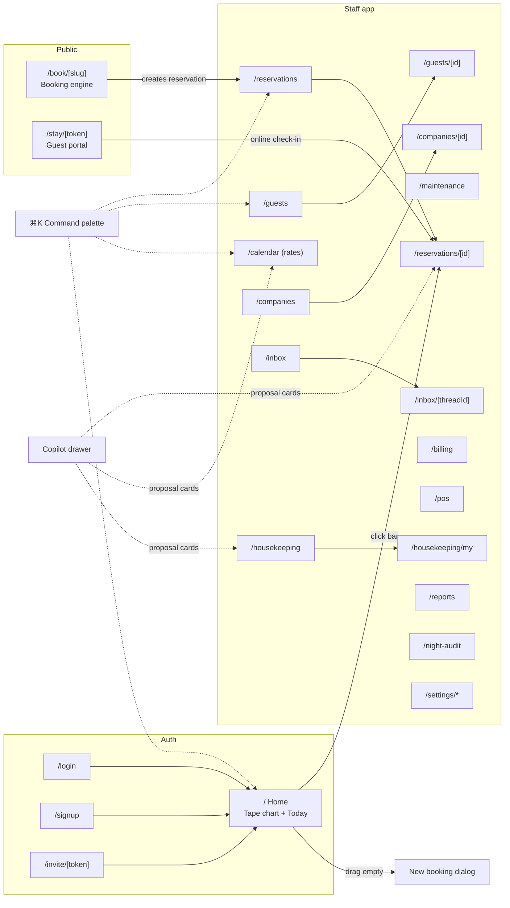

# 09 — Screen & Page Specifications

> Every page in GulfHero, one by one: route, users, layout, components, data, actions, and states. This is the UI contract — when a vibe-coding session builds a page, it builds *this* page. Global rules from `CLAUDE.md` apply everywhere (≤2-click actions, empty/loading states, keyboard nav, 1280px + 390px, EN/AR RTL).

## Navigation map

## Global UI elements (available on every staff page)

| Element | Spec |
|---|---|
| **Sidebar** | Icons + labels: Home, Reservations, Calendar, Housekeeping, Guests, Billing, Inbox, Reports, Settings. Collapsible to icons at <1280px; bottom sheet nav at phone width. Active state; badge counts (unread inbox, open work orders). Hidden entries per role (housekeeper sees Home/Housekeeping only). |
| **Top bar** | Property name + business-date chip (amber if audit overdue), global search field (focuses ⌘K), locale toggle EN/ع, dark-mode toggle, user menu (profile, cashier session status, logout). |
| **⌘K Command palette** | Fuzzy search over guests, reservations (by code/name/room), rooms, actions ("New booking", "Check in <room>", "Night audit", every settings page). Arrow keys + enter. Recent items. |
| **Copilot drawer** | Right-side drawer (⌘J or sparkle button). Chat history for the session, proposal cards with Confirm/Dismiss, feature-toggle aware. Never covers the tape chart on ≥1280px (overlays on mobile). |
| **Toasts & confirms** | Success toasts with undo where safe (e.g., HK status flip). Destructive confirm dialogs state the consequence ("Cancelling posts a 1-night fee of 350 SAR"). |
| **Audit timeline** | Reusable `<HistoryTimeline entity=… id=…/>` component fed by `domain_events`; embedded in reservation/folio/guest detail. |

---

## S1. Auth pages — `/login`, `/signup`, `/invite/[token]`

- **Login:** email+password, error state, forgot-password. **Signup:** creates account → "Create your property" step (name, timezone, currency, languages) → lands on Home with a setup checklist card. **Invite:** token → set password → lands with assigned role.
- States: loading buttons, invalid-token page for expired invites.

## S2. Home — `/` (tape chart + Today panel)

**Users:** front desk (primary), everyone. **Phase:** 1.4–1.5. *The most important screen in the product.*

- **Layout ≥1280px:** left 75% tape chart; right 25% Today panel. **Phone:** Today panel first, tape chart below as horizontally scrollable with sticky room column.
- **Tape chart:** rows = rooms grouped by room type (collapsible groups, floor filter); columns = days (14 default; 7/14/30 switch); today column highlighted; date-range pager. Cells show reservation bars: guest surname + pax icons, colored by status (tokens from step 0.1), diagonal stripe = unpaid balance, lock icon = OOO/OOS block. Left gutter shows room number + HK status dot (green clean / amber dirty / blue inspected).
- **Interactions:** hover/long-press → card (guest, dates, plan, balance, quick actions); click → reservation detail; drag bar vertically → move room (allocator-validated; re-price confirm if room type changes); drag bar edge → extend/shorten stay (confirm re-price); click-drag across empty cells → New booking dialog prefilled (room, dates); right-click/⋯ → context menu (check in, add charge, add note, cancel).
- **Today panel:** KPI row (occupancy %, arrivals n, departures n, in-house n). Lists: **Arrivals** (name, room type, room-or-"assign" button, balance chip, [Check in]); **Departures** (name, room, balance due badge, [Check out]); **Alerts** (arriving-room-dirty conflicts, unassigned arrivals, holds expiring today, expiring OOO). Each row = one-click to act.
- **Realtime:** subscribes to reservation/room/HK changes for the visible range; optimistic UI on drag with rollback toast on conflict.
- **States:** skeleton grid; empty (no rooms yet → CTA to settings); error banner with retry; offline badge (read-only cached view, Phase 5.5).

## S3. Reservations list — `/reservations`

**Phase:** 1.3.
- Toolbar: search (name/code/phone/room), filters (status multi, source, date range by arrival/departure/created), sort. Saved filter chips: "Arriving today", "In-house", "Unpaid departures", "Holds expiring".
- Table (desktop) / cards (mobile): code, guest, dates, nights, room type/room, status badge, source icon, balance, total. Row click → detail. Bulk select → export CSV.
- Header button: **New booking** (global dialog). States: skeleton rows, empty-with-CTA, no-results-for-filter.

## S4. Reservation detail — `/reservations/[id]`

**Phase:** 1.3, grows through 1.7/3.5/4.x.
- **Header:** guest name (link), status badge, dates (nights count), room type + room (assign/change inline), pax, source + channel ref, balance chip; primary action button contextual by status (Confirm / Check in / Check out); ⋯ menu (move room, extend, shorten, split stay, cancel, mark no-show, print GR card, resend confirmation).
- **Tabs:**
  - **Stay:** rate plan + per-night price table (editable pre-check-in w/ permission), policies, deposit status, notes, preferences, ETA field.
  - **Folio:** see S12 folio component embedded (charges/payments/balance, post charge, take payment, invoice actions).
  - **Guest:** profile summary + link; ID capture (masked, reveal w/ permission + audit); signature image.
  - **Messages:** thread with this guest (S14 component scoped to reservation).
  - **History:** audit timeline.
- **Check-in flow (dialog, ≤4 steps):** 1) confirm guest identity/details 2) room picker (clean rooms first, dirty flagged with override) 3) ID photo/upload + signature canvas 4) deposit (optional) → done; prints/emails GR card. Progress dots, all steps skippable-but-nagged except room.
- **Check-out flow (dialog):** folio review → settle (payment methods; or route to city-ledger w/ permission) → invoice (print/email) → done → room flips dirty + HK task toast.
- **Cancel dialog:** shows computed fee from policy, reason (required), refund handling; writes audit.

## S5. New booking dialog (global)

**Phase:** 1.3. Opened from Home button, ⌘K, tape-chart drag, or copilot proposal.
- **One screen, ≤30s:** date-range picker (defaults today+1) + pax stepper → live room-type cards (name, photo thumb, available count, price/night from selected rate plan, meal-plan selector) → guest field (typeahead over existing guests; "new guest" inline: name + phone only) → optional: company account, deposit, notes (collapsed "More"). Footer: total with tax breakdown; buttons: **Book** (confirmed) / Hold 24h / Book & check in (visible if dates start today).
- Group mode toggle: quantity per room type, rooming list paste-in later from detail.
- Errors: no availability → nearest available alternatives shown ("Deluxe free Thu–Sat, or Standard these dates").

## S6. Rate calendar — `/calendar`

**Phase:** 1.1, +4.5 badges.
- Grid: rows = rate plans grouped by room type; columns = 30 days (paged); cells = price + tiny flags (min-stay, CTA/CTD, stop-sell). Weekend columns tinted. Availability row per room type on top (rooms left per day, red at 0).
- Editing: click cell → inline input; drag-select cells → bulk editor panel (set price / adjust ±% / min stay / flags, applied to selection); **Bulk update** dialog (date range × weekdays × plans). Derived plans show computed price with a link to the parent.
- **AI badges (4.5):** sparkle on cells with pending suggestions; click → popover (suggested price, why, Accept/Dismiss); toolbar "Review all suggestions" → side panel list with bulk accept.
- Keyboard: arrows move cell focus, enter edits, esc cancels. States: skeleton grid; "no rate plans yet" CTA.

## S7. Housekeeping — `/housekeeping` (supervisor) and `/housekeeping/my` (attendant)

**Phase:** 2.1, +4.8 priority.
- **Supervisor board:** filter chips (All / Due today / Dirty / Inspect / OOO). Room cards grid: number, type, HK status color, occupancy overlay (vacant/occupied/departing/arriving), assigned attendant avatar, priority rank. Drag card onto attendant column (or select→assign) to distribute. Discrepancy list (front-desk vs HK mismatch). "Auto-assign" button balances open tasks.
- **Attendant view (phone-first):** ordered task list (priority from F6): room number big, task kind (departure/stayover/inspect), guest-arriving-tonight flag, tap → detail (checklist, photo notes, DND button, report-issue → work order) → giant "Mark clean" button. Status flips write realtime.
- States: all-done celebration state; offline queue indicator (5.5).

## S8. Maintenance — `/maintenance`

**Phase:** 2.2. Work-order list (open/in-progress/resolved tabs), card: room, title, photo thumb, priority, assignee, age. New work order dialog (room, title, description, photos, priority, create-OOO-block toggle with date range). Detail drawer with comment trail + resolve button (prompts to lift OOO block if one exists).

## S9. Guests — `/guests`, `/guests/[id]`

**Phase:** 1.8.
- **List:** search (name/phone/email/ID), tag filters (VIP, blacklist), table with stays count + lifetime value. Dedupe banner: "3 possible duplicates" → merge review screen (side-by-side field picker).
- **Profile:** header (name, nationality flag, tags editable, contact); tabs: **Stays** (history table, upcoming vs past), **Billing** (invoices), **Messages** (all threads), **Details** (ID masked w/ reveal permission, preferences, marketing consent, GDPR export/delete buttons), **History** (audit).

## S10. Companies — `/companies`, `/companies/[id]`

**Phase:** 1.8. List with kind filter (corporate/agent), credit used vs limit bar. Detail: negotiated rate plans links, booker contacts, **City ledger tab**: open invoices table, record payment against invoices, statement PDF export, aging chips (30/60/90).

## S11. Billing hub — `/billing`

**Phase:** 1.6–1.7, 2.4.
- Tabs: **Open folios** (in-house + due-out, balance sorted), **Invoices** (search by number/guest, reprint/re-email), **City ledger** (cross-company aging summary → company detail), **Cashier sessions** (2.4: open/close my session dialog with float + count; sessions table w/ variance badges; shift report print).

## S12. Folio component (embedded in reservation detail & billing)

**Phase:** 1.6–1.7. Line-item table grouped by business date: description (bilingual), qty × unit, tax, total; payments in green; voided struck-through. Running balance sticky footer. Actions: **Post charge** (item catalog picker or free entry + tax auto), **Take payment** (method tabs: cash/card-Stripe/bank/city-ledger; amount defaults to balance), **Discount/adjustment** (reason required), **Void** (same-day, reason), **Split folio** (move selected lines to new/company folio), **Invoice** (issue → number assigned, PDF preview, email). Every action permission-gated + audited.

## S13. POS-lite — `/pos`

**Phase:** 2.6. Outlet picker → phone-friendly item grid (categories tabs, big touch targets) → cart → charge-to: room picker (in-house search) or cash sale → posts to folio with outlet tag. Daily outlet summary link.

## S14. Inbox — `/inbox`, `/inbox/[threadId]`

**Phase:** 3.5, +4.4 AI.
- **List:** threads (guest, channel icon email/WhatsApp, snippet, unread dot, linked reservation chip), filters (unread/channel/needs-reply). 
- **Thread:** message bubbles w/ delivery status; reservation context card pinned (dates, room, balance); composer with template picker; **AI panel (4.4):** intent tag, suggested reply (editable), translate toggle, send. Auto-send rules badge when active.
- **Templates editor** lives in Settings (S17); journey status (sent/scheduled) visible on reservation Messages tab.

## S15. Reports — `/reports`

**Phase:** 2.5, +4.6.
- **GM dashboard (default tab):** KPI tiles (tonight occupancy %, ADR, RevPAR, revenue today MTD) each with vs-last-year delta; charts: 30-day occupancy forecast bar, revenue by category stacked area (MTD), channel mix donut, pickup line (bookings made last 7 days). Date-range switcher.
- **Canned reports tab:** cards for Arrivals/Departures, In-house, Police report (per-country export format), Tax report, Cashier/shift, Production by source/company, City-ledger aging, Forecast. Each: filters → table → CSV/PDF/print. 
- **Ask your data (4.6):** input box + suggested questions; answer = narrative sentence + chart + table + "save to dashboard" button; saved questions row.

## S16. Night audit — `/night-audit`

**Phase:** 2.3. Full-page guided checklist: sections auto-checked when clear — pending arrivals (rows w/ [Check in] [No-show] [Cancel]), pending departures ([Check out] [Extend]), unposted charges, open cashier sessions, negative-balance folios. All clear → big **Run night audit** button → progress log (post room charges → taxes → stats snapshot → roll date) → summary screen (rooms sold, revenue, ADR, exceptions) with print. Re-run guarded (idempotent, shows "already run for date X").

## S17. Settings — `/settings/*`

**Phase:** 0.3 onward; one left-subnav layout, each page simple forms with zod validation + save toasts.

| Page | Contents |
|---|---|
| `/settings/property` | Profile, logo, address, timezone, currency, check-in/out times, languages, tax IDs |
| `/settings/room-types` | CRUD list → editor (bilingual name/desc, occupancy, amenities, photo upload, sort) |
| `/settings/rooms` | Table w/ inline edit (number, floor, type, features); bulk add ("create 101–110") |
| `/settings/rate-plans` | CRUD; meal plan, policies link, derivation editor ("BB = RO + X/person") |
| `/settings/taxes` | CRUD; kind, %/amount, inclusive toggle, applies-to |
| `/settings/policies` | Cancellation policies builder (free-until X days, fee %/nights), deposit rules, no-show fee, child ages |
| `/settings/users` | Members table (role change, deactivate), invite dialog, permission matrix editor per role |
| `/settings/templates` | Message templates per trigger × channel, bilingual editor w/ variables palette ({guest_name}, {checkin_date}…), enable toggles, send offsets |
| `/settings/booking-engine` | Slug, theme colors, photos, policies copy, deposit rule, promo codes CRUD |
| `/settings/integrations` | Stripe connect status, Twilio/WhatsApp, Resend domain, iCal feeds (per room type, copy URL / add import URL, last-sync + error badges), channel partner (3.4) |
| `/settings/ai` | Feature toggles per AI feature, autopilot bounds, monthly budget cap + usage meter by feature, kill switch |
| `/settings/outlets` | POS-lite outlets + item catalogs (2.6) |
| `/settings/upsells` | Offer CRUD: name, price, availability rules (5.2) |

## S18. Booking engine (public) — `/book/[slug]`

**Phase:** 3.1–3.2. Guest-facing, bilingual, property-branded (logo/colors), mobile-first, no login.
1. **Search bar:** dates + guests (persistent header). 2. **Results:** room-type cards (photo carousel, bilingual desc, amenities icons, "2 left" scarcity tag, per-plan prices w/ meal-plan + refundability labels) → select. 3. **Details:** guest form (name/email/phone/nationality), special requests, promo code field, policy text. 4. **Payment:** Stripe element (deposit or full per property rule), price summary w/ tax lines. 5. **Confirmation:** code, summary, add-to-calendar, "manage booking" link (→ portal). 
- Trust elements: policy clarity, secure-payment badge. SEO: property schema.org markup. States: no-availability (alternative dates strip), payment-failed retry, session-expired re-price notice.

## S19. Guest portal (public) — `/stay/[token]`

**Phase:** 5.1–5.2. Magic-link, no password.
- **Booking view:** dates/room/policies, cancel button (policy-enforced). **Online check-in:** step form (details confirm, ID photo upload, signature, ETA) → "you're pre-registered" state. **Upsells:** offer cards (AI-ranked) → add → pays or posts to folio per rule. **During stay:** live folio view, message-the-desk button (→ inbox thread). **Express checkout:** review folio → pay balance → email invoice.

---

## Screen inventory ↔ roadmap cross-reference

| Screen | Built in step(s) |
|---|---|
| S1 auth | 0.2 | 
| S2 home/tape chart | 1.4, 1.5 |
| S3/S4/S5 reservations | 1.3, 1.5, 1.6, 1.7 |
| S6 rate calendar | 1.1, 4.5 |
| S7 housekeeping | 2.1, 4.8 |
| S8 maintenance | 2.2 |
| S9 guests | 1.8 |
| S10 companies | 1.8 |
| S11/S12 billing+folio | 1.6, 1.7, 2.4 |
| S13 POS | 2.6 |
| S14 inbox | 3.5, 4.4 |
| S15 reports | 2.5, 4.6 |
| S16 night audit | 2.3 |
| S17 settings | 0.3, 0.6, then per feature |
| S18 booking engine | 3.1, 3.2 |
| S19 guest portal | 5.1, 5.2 |
